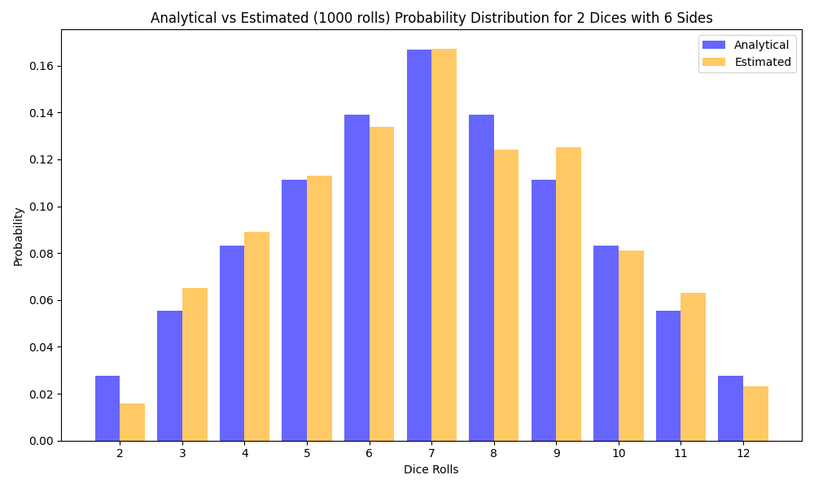
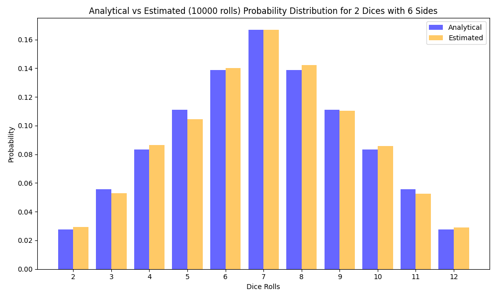

### Висновки
 
З результатів видно, що ймовірності, отримані методом Монте-Карло, наближаються до аналітичних значень.
І хоча невеликі відхилення можуть спостерігатися, 
можна зробити висновок що метод Монте-Карло дозволяє оцінити ймовірності для кожної суми значень при кидку кубиків.

1. **Порівняння аналітичних та емпіричних значень**:
   - Розбіжності в імовірностях для різних сум, наприклад, для суми 7, є незначними. 
   - Найпоширеніші значення (середні сумарні значення, такі як 6, 7 і 8) у Монте-Карло результатах мають тенденцію до правильних значень, що підтверджує точність методу.
   - Відмінності в менш ймовірних сумах (наприклад, 2 або 12) теж невеликі, 
але можуть трохи варіюватися через меншу ймовірність їх випадіння.

2. **Точність оцінок**:
   - Зі збільшенням кількості кидків метод Монте-Карло наближається до аналітичних значень через закон великих чисел. 
   - Наприклад, при 1000 кидках результати вже близькі, але при 10000 спроб вони стають ще точнішими.

